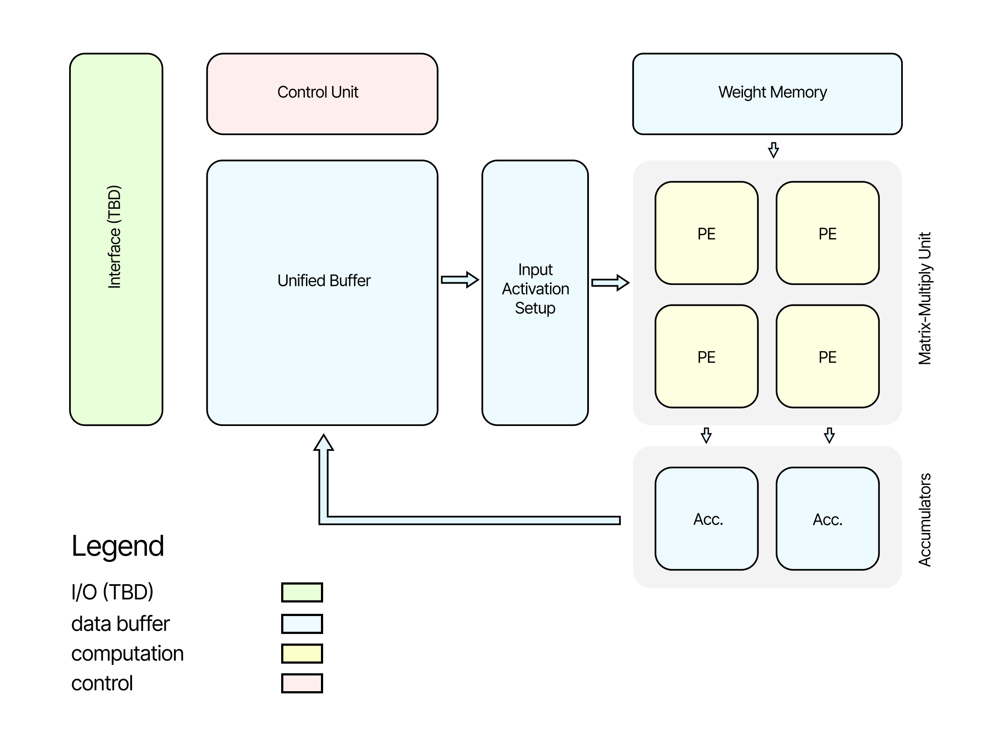
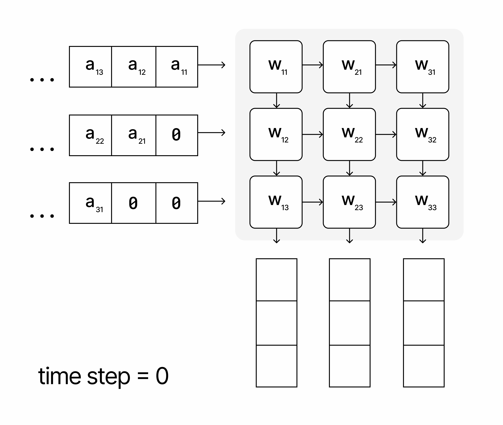
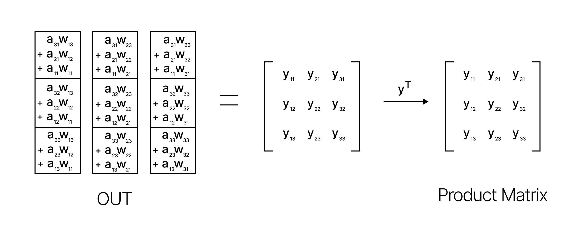
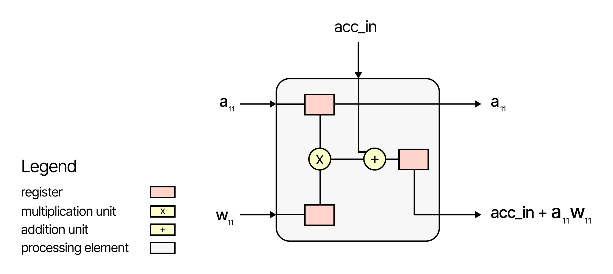

# Tiny-TPU

A minimal Tensor Processing Unit (TPU) inspired by Google's TPUv1.

<p align="center">
  
</p>

## Table of Contents
1. [Architecture](#architecture)
2. [Motivation](#motivation)
3. [Instructions](#instructions)
   - [LOAD_ADDR](#load_addr)
   - [LOAD_WEIGHTS](#load_weights)
   - [LOAD_INPUT](#load_input)
   - [COMPUTE](#compute)
   - [STORE_RESULTS](#store_results)
   - [NOP](#nop)
4. [Future Extensions (TBD)](#future-extensions-tbd)
5. [Example Instruction Sequence](#example-instruction-sequence)
   - [Initializing and Running the Systolic Array](#initializing-and-running-the-systolic-array)
6. [Understanding the Systolic Array](#understanding-the-systolic-array)
   - [How It Works](#how-it-works)
   - [Multiplication in the Systolic Array](#multiplication-in-the-systolic-array)
7. [Understanding the Processing Element](#understanding-the-processing-element)
   - [How a Processing Element Works](#how-a-processing-element-works)

## Architecture

<p align="center">
  
</p>

The high-level architecture of our minimal TPU consists of several key components working together to perform efficient matrix multiplications. Here's an overview of the main components and their roles:

- **Control Unit**: This component orchestrates the overall operation of the TPU. It interprets and executes instructions, managing the flow of data between different components.
- **Unified Buffer**: A large memory unit that stores input data and results. It serves as the primary data storage for the TPU, holding input matrices and storing the output of computations.
- **Weight Memory**: A dedicated memory unit for storing weight matrices. This allows for quick access to weights during computations.
- **Input Activation Setup**: This unit prepares input data from the Unified Buffer for processing in the Matrix Multiply Unit. It may involve formatting or reorganizing the data for efficient computation.
- **Matrix Multiply Unit**: The core computational engine of the TPU, consisting of:
  - **Processing Elements (PEs)**: Arranged in a 2x2 grid, these are the basic computational units that perform multiply-accumulate operations.
  - **Accumulators**: Located at the bottom of the PE array, these units accumulate the results of computations from each column of PEs.

- **Interface (TBD)**: A component for input/output operations, allowing the TPU to communicate with external systems or memory.

The data flow in this architecture typically follows this pattern:

1. Input data is loaded into the Unified Buffer.
2. Weights are loaded into the Weight Memory.
3. The Input Activation Setup prepares data from the Unified Buffer.
4. The Matrix Multiply Unit processes the data, with PEs performing computations and Accumulators collecting results.
5. Results are stored back in the Unified Buffer.
6. The Control Unit manages this entire process based on the instructions it receives.

## Instructions

This ISA defines the operations for a minimal TPU with a weight-stationary systolic array architecture. Below are the instructions, their purposes, and example usages.

### LOAD_ADDR

Loads the address of a memory partition into a single register.

**Example Usage:**

```verilog
16'b001_0000000001111;  // LOAD_ADDR 0x000F (16th address)
```

### LOAD_WEIGHTS

Loads weights from a weight buffer into the systolic array.

**Example Usage:**

```verilog
16'b010_0000000000000;  // LOAD_WEIGHT (Weights are transferred from weight memory into mmu)
```

### LOAD_INPUT

Loads inputs from the unified buffer into the input setup unit.

**Example Usage:**

```verilog
16'b011_0000000000000;  // LOAD_INPUT
```

### COMPUTE

Performs systolic computation on the loaded weights and inputs.

**Example Usage:**

```verilog
16'b100_0000000000000;  // COMPUTE (Compute starts, systolic operations are automated by here)
```

### STORE_RESULTS

Stores the results from the accumulators back to the unified buffer.

**Example Usage:**

```verilog
16'b101_0000000000000;  // STORE_RESULTS
```

### NOP

End of instructions.

**Example Usage:**

```verilog
16'b000_0000000000000;  // NOP or END (indicate end of instructions)
```

## Future Extensions (TBD)

- **START:** Initial startup instruction.
- **JMP START:** Jump to the START instruction.
- **NEXT_LAYER:** Prepare for the next layer of inputs.

## Example Instruction Sequence

### Initializing and Running the Systolic Array

The following sequence of instructions is loaded directly into the instruction memory. This setup allows for the automatic execution of these instructions by the control unit:

```verilog
instruction_mem[0] = 16'b001_0000000001111;  // LOAD_ADDR 0x000F (16th address)
instruction_mem[1] = 16'b010_0000000000000;  // LOAD_WEIGHT (Weights are transferred from weight memory into mmu)
instruction_mem[2] = 16'b001_0000000011110;  // LOAD_ADDR 0x001E (30th address)
instruction_mem[3] = 16'b011_0000000000000;  // LOAD_INPUT
instruction_mem[4] = 16'b100_0000000000000;  // COMPUTE (Compute starts, systolic operations are automated by here)
instruction_mem[5] = 16'b001_0000000000111;  // LOAD_ADDR 0x0007 (7th address)
instruction_mem[6] = 16'b101_0000000000000;  // STORE_RESULTS
instruction_mem[7] = 16'b000_0000000000000;  // NOP or END (indicate end of instructions)
```

I hope this guide kickstarts your journey into hardware design and demystifies TPU instruction sets! Let me tell you a secret - when I began this project, I was a complete novice in digital logic. I only started learning Verilog three weeks ago! But here's the thing: if I can do it, you absolutely can too.

## Understanding the Systolic Array

The systolic array is a hardware design used to perform matrix multiplications efficiently. It consists of a grid of processing elements (PEs) that compute and pass data through the array in a synchronized manner. This allows for high parallelism and throughput, making it ideal for deep learning tasks.

### How It Works

1. **Data Flow**: Data flows through the array in a pipelined manner. Weights are pre-loaded into the PEs, and inputs are fed from the left.
2. **Processing Elements**: Each PE performs multiply-accumulate operations. It multiplies the incoming data (inputs) with the provided weights and adds the result to an accumulator.
3. **Synchronization**: All PEs operate in lock-step, synchronized by a global clock, ensuring that data moves uniformly across the array.
4. **Output**: The results are accumulated in the final PEs and can be read out after the computation is complete.

### Multiplication in the Systolic Array

In the systolic array, multiplication is tied to the multiply-accumulate (MAC) operations performed by each PE. Each PE takes an input and a weight, multiplies them, and adds the result to an accumulator. The accumulators hold the intermediate sums, which are eventually used to produce the final output matrix.

<p align="center">
  
</p>

By nature of how the systolic array is set up, each row of the product matrix is stored in its respective accumulator. In the gif above, the output of each row output of a matrix is transferred to a local memory during "OUT" 

<p align="center">
  
</p>

By visualizing the systolic array, you can see how data flows and interacts within the array, leading to efficient matrix multiplications.

## Understanding the Processing Element

The processing element (PE) is a fundamental building block of the systolic array. Each PE is responsible for performing multiply-accumulate (MAC) operations, which are critical for matrix multiplication.

### How a Processing Element Works:

<p align="center">
  
</p>

1. **Inputs**: Each PE receives an input value (`a_11`) and a weight (`w_11`).
2. **Multiplication**: The input value and weight are multiplied together.
3. **Accumulation**: The result of the multiplication is added to the current value in the accumulator (`acc_in`).
4. **Outputs**: The PE outputs the accumulated result (`acc_in + a_11 * w_11`) and passes the input value to the next PE in the row.

The diagram above illustrates the internal structure of a PE, showing the flow of data through the multiplication and addition units.

## Motivation

I recently took on an interesting challenge – reverse-engineering Google's Tensor Processing Unit (TPU) design. Since the real TPU architecture is closed-source, I had to work from the original paper to build a minimal version with a weight-stationary systolic array.

This project was motivated by my belief that it's important for newcomers to explore different AI acceleration approaches beyond just GPUs. Many people want to understand how parallel processing actually works at the hardware level, not just in software.

What's cool is that I started this with basically no digital logic experience – I only began learning Verilog three weeks ago! But I was able to create a working TPU from scratch in that time. I think it demonstrates that hardware design doesn't have to be as intimidating as it might seem.

My hope is that this can serve as an approachable guide for others looking to get into hardware design, especially for AI acceleration. While GPUs are the go-to for ML training right now, I think there's value in understanding alternative architectures too.